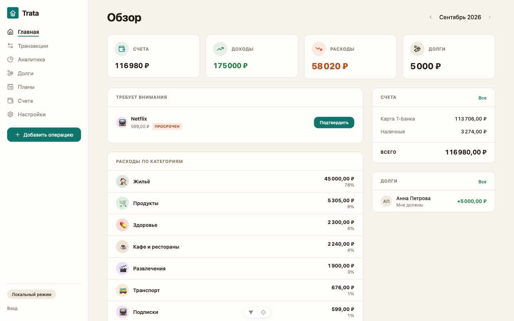
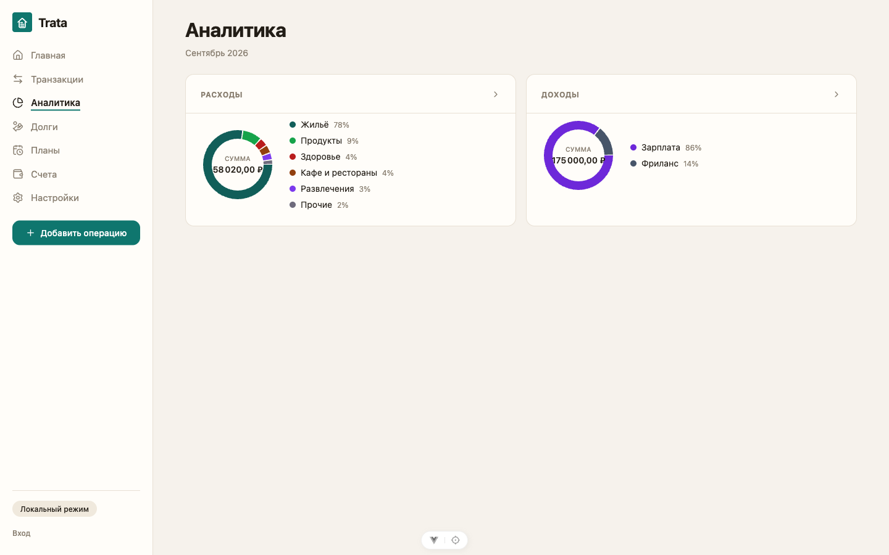
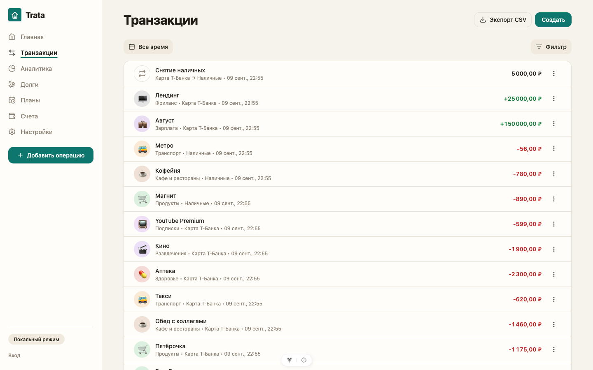
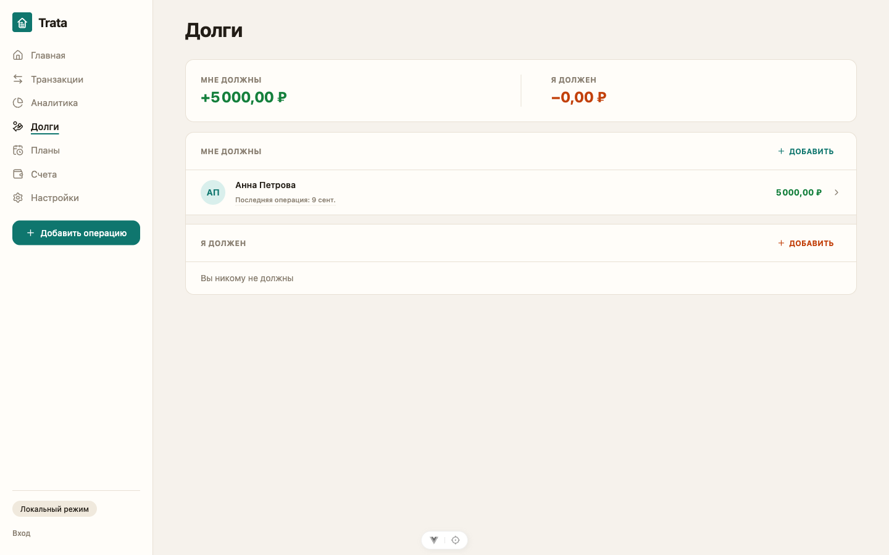
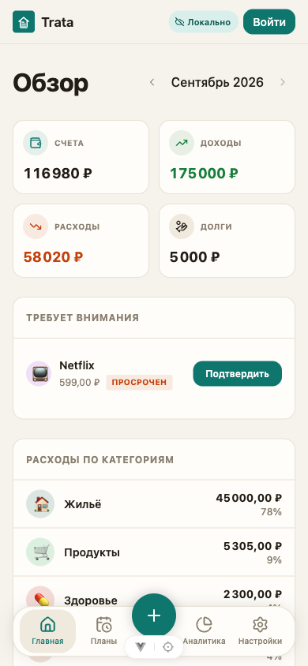

# Trata

Trata is a self-hosted personal and household expense tracker: record a spend
in seconds, see where money goes this month, keep balances, debts and planned
payments under control, and share one budget with the family. Anonymous-first
and local-first on the web - the app fully works without an account (local
SQLite via OPFS), sign-in only adds background server sync. No subscriptions,
no third-party aggregators: the family's data lives on its own server.

| Dashboard | Analytics | Transactions |
| --- | --- | --- |
|  |  |  |

| Debts | Mobile (PWA, 390px) |
| --- | --- |
|  |  |

## Features

- **Fast entry** - one dialog for expense / income / transfer (hotkey `N`,
  command palette `Cmd+K`, FAB speed-dial on mobile), inline category creation.
- **Local-first web PWA** - installable app shell with a service worker and an
  offline SQLite database (OPFS); guest mode works without any account.
- **Household budget** - members share accounts, categories, transactions,
  debts and planned payments from the moment they join (email + join-code
  invites, ADR-0002).
- **Money domain** - RUB-only accounts with derived balances, two-direction
  debts, planned payments confirmed into transactions, balance reconciliation
  (adjustments).
- **Analytics** - donut + category breakdown per week / month / year with
  drill-down detail pages.
- **Sync engine** - pending-ops push protocol, user-resolved conflicts with a
  conflict center (ADR-0003).
- **OpenAPI-first** - `docs/api/openapi.yaml` is the single source of truth;
  Go server and TS client types are generated from it and drift-gated in CI.
- **Money correctness** - every amount is an `int64` of minor units end to
  end; no floats at any boundary.

## Architecture

```
backend/        Go API (Gin + sqlc + Postgres)
apps/web/       Vue 3 + Vite (Feature-Sliced Design, local-first PWA)
apps/mobile/    React Native + Expo (FSD + Expo Router, offline-first)
packages/       shared TS: api, dates, money, i18n; shared css: tokens
docs/           architecture, ADRs, deployment; docs/api/ = OpenAPI contract
openspec/       domain behavior specs + proposed changes
deploy/backup/  production backup sidecar (pg_dump + rclone + crond)
scripts/        deploy tooling (tags, rollback, migration guard)
```

The Go backend and the JS workspaces (`apps/*`, `packages/*`) are independent
toolchains: `pnpm install` only manages the JS side and ignores `backend/`.

Deep dives: `docs/architecture/overview.md` (baseline with file-level
evidence), `docs/architecture/invariants.md` (enforced rules), `docs/adr/`
(auth/CSRF, household budget, sync protocol), `docs/architecture/findings.md`
(finding history), `docs/technical-debt.md`.

## Getting started

Prerequisites: Go 1.26+, pnpm 10+, Docker (Postgres for local runs and
integration tests), Node 24.

### Backend

```bash
cd backend
cp .env.example .env       # CONFIG_PATH + DATABASE_URL (local Postgres)
docker compose up -d db    # local Postgres
make dev                   # go run ./cmd/expense-tracker-api -> :8080
```

### Web

```bash
pnpm install               # repo root, all JS workspaces
cd apps/web
pnpm dev                   # Vite dev server on :5173, proxies /api to :8080
pnpm build                 # type-check + production build
```

The web app works without the backend (anonymous local mode); with the API
running, sign-in adds sync.

### Mobile

```bash
cd apps/mobile
pnpm ios                   # or: pnpm android
```

## Testing

| Area | Command | Notes |
| --- | --- | --- |
| Backend | `cd backend && make test` | `go test -race ./...`; repository/e2e suites use testcontainers (Docker) |
| Web unit | `pnpm --filter web test:unit` | Vitest + jsdom |
| Web e2e | `pnpm --filter web test:e2e` | Playwright (dev server auto-starts; PWA specs: `test:e2e:pwa`) |
| Mobile unit | `pnpm --filter mobile test` | Jest |
| Contract & architecture | `pnpm arch:check`, `pnpm sync-catalog:parity` | dependency-cruiser, OpenAPI parity, spec lint in CI |

Coverage, measured September 2026:

| Area | Statements | How |
| --- | --- | --- |
| Backend | **58.4%** | `go test -coverpkg=./... -coverprofile=cov.out ./...` then `go tool cover -func=cov.out` (includes generated `api.gen.go` and `cmd/`; e2e via testcontainers attributed) |
| Web | **70.3%** (70.8% lines) | `pnpm --filter web test:coverage` |

Current suite sizes: 770 web unit tests (114 files), 419 mobile tests, 167 Go
test functions, 19 Playwright e2e specs. CI (`.github/workflows/ci.yml`) gates
spec lint, breaking-change detection (oasdiff), codegen drift, architecture
rules, design-system rules, backend lint + tests, and Docker image smoke
builds.

The README screenshots live in `docs/screenshots/` and are regenerated with
`README_SCREENS=1 pnpm --filter web exec playwright test
e2e/readme-screens.spec.ts --project=chromium` (seeds a demo month through the
UI on a fresh profile).

## Deployment

Production runs as Docker images behind a reverse proxy; `scripts/` holds the
deploy/rollback tooling and `deploy/backup/` the pg_dump sidecar. See
`docs/deployment.md`.

## Repository notes

`AGENTS.md` (root + per area) documents working rules for humans and coding
agents; `.superdesign/design-system.md` pins the implemented visual system
(warm paper minimal, tokens in `packages/tokens`).
